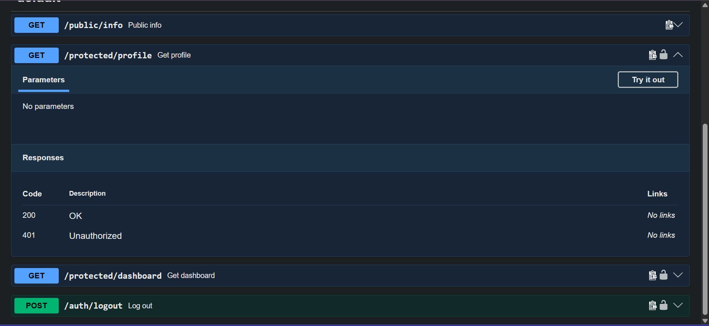

# FlyRank AI — Backend Track: Task & Auth API

A CRUD API for managing tasks, backed by PostgreSQL, with Supabase-powered authentication protecting private routes. Fully containerized with Docker.

## How to run it

1. Clone this repo
2. Copy `.env.example` to `.env` and fill in your own Supabase URL/key + database credentials
3. Run `docker compose up`
4. The API is live at `http://localhost:3000`, Swagger docs at `http://localhost:3000/docs`

## Environment variables

See `.env.example` for the required keys: `DATABASE_URL`, `SUPABASE_URL`, `SUPABASE_KEY`, `PORT`.

## Endpoints

| Method | Endpoint | Auth required | Description |
|---|---|---|---|
| GET | /tasks | No | List all tasks |
| GET | /tasks/:id | No | Get one task |
| POST | /tasks | No | Create a task |
| PUT | /tasks/:id | No | Update a task |
| DELETE | /tasks/:id | No | Delete a task |
| GET | /public/info | No | Public welcome message |
| POST | /auth/signup | No | Create a new user account |
| POST | /auth/login | No | Log in, returns access + refresh token |
| POST | /auth/logout | Yes | End the current session |
| GET | /protected/profile | Yes | Get the logged-in user's profile |
| GET | /protected/dashboard | Yes | Example second protected route, reusing the same auth middleware |

## Auth flow

1. Sign up or log in via Supabase — this project never stores or hashes passwords itself.
2. Login returns a JWT access token.
3. Protected routes require `Authorization: Bearer <token>` in the header.
4. A reusable `requireAuth` middleware verifies the token with Supabase before letting the route run, and rejects missing/invalid/expired tokens with 401.

## Swagger UI

Interactive docs, with a padlock on every protected route, live at `/docs`. Click "Authorize," paste a token from `/auth/login`, and test protected routes directly from the browser.

## Storage & security history

- **A1:** in-memory array
- **A2:** SQLite file
- **A3:** PostgreSQL in Docker, with a full docker-compose stack
- **A4 (this):** Supabase Auth added on top — routes are now guarded, not open to anyone
