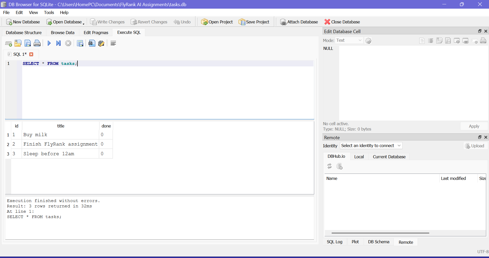

# FlyRank AI — Backend Track: Task API

A CRUD API for managing tasks, built with Express and backed by PostgreSQL, running in Docker.

## How to run it (one command)

1. Clone this repo
2. Copy `.env.example` to `.env`
3. Run `docker compose up`
4. The API is live at `http://localhost:3000`, with Postgres running alongside it and 3 example tasks seeded automatically.

## Environment variables

See `.env.example` — copy it to `.env` and fill in real values (or use the defaults, which match `docker-compose.yml`).

## Endpoints

| Method | Endpoint | Description |
|---|---|---|
| GET | /tasks | List all tasks |
| GET | /tasks/:id | Get one task |
| POST | /tasks | Create a task (`{ "title": "..." }`) |
| PUT | /tasks/:id | Update a task (`{ "title": "...", "done": true }`) |
| DELETE | /tasks/:id | Delete a task |

## Example request

\`\`\`
curl -i http://localhost:3000/tasks
\`\`\`

Returns the 3 seeded tasks as JSON, straight from Postgres.

## Storage history

This project moved storage three times, with the API never changing:
- **A1:** an in-memory array (data lost on restart)
- **A2:** a SQLite file, `tasks.db` (survives app restarts)
- **A3 (this):** PostgreSQL, running in its own Docker container with a volume (survives full container restarts too)

## Proving persistence

Created a few tasks, ran `docker compose down` then `docker compose up` again — the full app and database were destroyed and recreated, and all tasks were still there, thanks to the named volume (`taskdata`) keeping the actual data outside the container.

